<div align="center">
  
</div>

<div align="center">
  <a href="https://github.com/tokensoftwares">
    
  </a>
</div>

```console
kareem@tokensoftwares:~$ whoami
Software engineer focused on full-stack products, backend systems, and intelligent interfaces.
```

### `01 // About`

I like building software that connects a clean interface to solid engineering underneath. My experience spans **Spring Boot + Angular applications**, **PostgreSQL-backed systems**, **computer vision**, iOS development, and interactive projects in Unreal Engine.

- Currently building practical full-stack and AI-assisted projects
- Interested in backend architecture, system design, and computer vision
- Experienced through frontend, iOS, and Spring Boot backend internships
- I enjoy turning an idea into something people can actually use

### `02 // Build matrix`

<div align="center">
  
</div>

### `03 // Selected work`

| Project | Signal |
|:---|:---|
| **Hand Gesture Computer Controller** | Computer-vision mouse control with smooth cursor tracking, clicks, and continuous gesture scrolling |
| **Full-Stack Systems** | Spring Boot, Angular, PostgreSQL, REST APIs, authentication, booking flows, and admin dashboards |
| **Interactive & Mobile** | Projects built with Unreal Engine C++ and SwiftUI, from real-time interaction to native iOS interfaces |

<div align="center">
  <a href="https://github.com/tokensoftwares?tab=repositories">
    
  </a>
</div>

### `04 // Activity signal`

<div align="center">
  <picture>
    <source media="(prefers-color-scheme: dark)" srcset="https://github-readme-stats.vercel.app/api?username=tokensoftwares&show_icons=true&hide_border=true&bg_color=00000000&title_color=67E8F9&text_color=C7D2FE&icon_color=C084FC&ring_color=67E8F9" />
    
  </picture>
  <picture>
    <source media="(prefers-color-scheme: dark)" srcset="https://github-readme-stats.vercel.app/api/top-langs/?username=tokensoftwares&layout=compact&hide_border=true&bg_color=00000000&title_color=67E8F9&text_color=C7D2FE" />
    
  </picture>
</div>

<div align="center">
  <picture>
    <source media="(prefers-color-scheme: dark)" srcset="https://github-readme-activity-graph.vercel.app/graph?username=tokensoftwares&bg_color=00000000&color=C7D2FE&line=67E8F9&point=C084FC&area=true&area_color=7C3AED&hide_border=true&custom_title=Contribution%20Signal" />
    
  </picture>
</div>

### `05 // Connect`

<div align="center">
  <a href="https://github.com/tokensoftwares">
    
  </a>
</div>

<div align="center">
  <sub><code>while (curious) { learn(); build(); improve(); }</code></sub>
</div>
